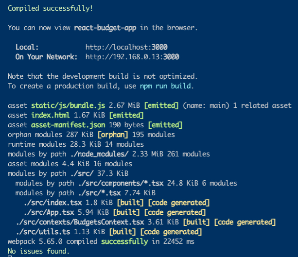
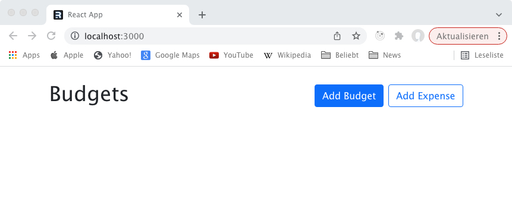
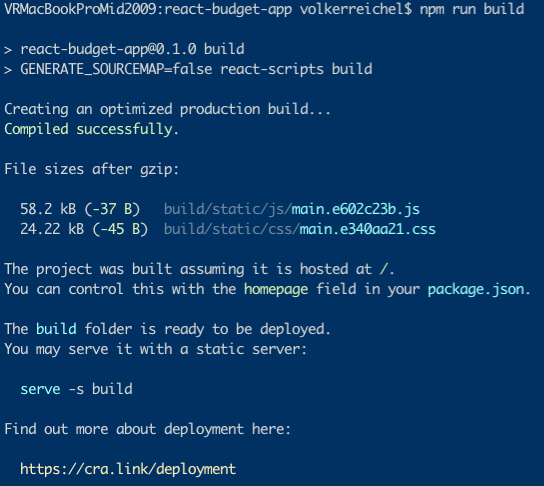
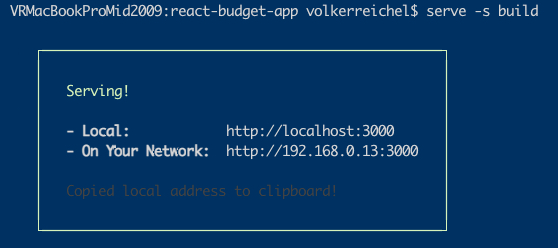

# Getting Started with Create React App

## Acknowledgement

This project was forked from [WebDevSimplified/Kyle](https://github.com/WebDevSimplified/react-budget-app.git).

This project was bootstrapped with [Create React App](https://github.com/facebook/create-react-app).

## Installation

1. Install create-react-app

    ```sh
    npm install -g create-react-app
    ```

2. Install Bootstrap

    The application uses _Bootstrap_ for UI components and layout. We also need the _react_ adaption to bootstrap.

    ```sh
    npm install --save react-bootstrap bootstrap@5.1.3
    ```

3. Install Dependent Modules

    ```sh
    npm install
    ```

## Verify Successful Intallation

Start the webapp via _npm_.

```sh
npm start
```

Your console should show the following output:



Your default browser should open and display the following:



## Running The App In Production Mode

1. Install A Server

    ```sh
    npm install -g serve
    ```

1. Build Prodction App

    ```sh
    npm run build
    ```

    The console should show:

    

1. Run The Server From build directory

    ```sh
    serve -s build
    ```

The console will show:



1. Your Browser Shows


## Prepare For Code Migration

The migration will be done according to the steps listed in [React Docs](https://create-react-app.dev/docs/adding-typescript).

1. Step: Install typescript to your project
   npm install --save typescript @types/node @types/react @types/react-dom @types/jest

2. Step: Install usehooks-ts
   _usehooks-ts_ is a typescript library to work easily with hooks in react.
   The original application defined its own (local) _useLocalStorage()_ function.
   This migration makes use of a commonly used _react hook_ library.
   To avoid a pletoria of warnings during build regarding missing source maps the _start_ and _build_ scripts in `package.json` have to be modified. The generation of sourcemaps has to be disabled.

3. Step: Change File Extension
   For files containing JSX-syntax rename the file from _.js_ to _.tsx_.
   Files without JSX-syntax must be renamed to _.ts_.

4. Step: Delete Directory _hooks_
   The contents is no longer needed. See above section.

## Migrate The Source

Typescript is a superset of Javascript which added among many other features a strict typing system to the language.
Enhancing the existing code by explicitely defining the type of data used will be our task now.
Why all this effort?

* **First**: Bugs can be found during compile time and not runtime.

* **Second**: A suitable IDE can infer the types allowed at the current position in the source and display hints to the programmer.

### Defining Types / Interfaces For The Apps Entities

The application deals with _Budgets_ and _Expenses_.

```typescript (file: BudgetContetx.tsx)
export type Budget = {
  id: string;
  name: string;
  max: number;
}

export type Expense = {
  id: string;
  description: string;
  amount: number;
  budgetId: string;
}
```

These definitions can now be used to make the _BudgetsContexts_ used as a _Provider_ in _JSX_-code more concise.

``` typescript
interface BudgetsContextInterface {
  budgets: Budget[];
  expenses: Expense[];
  getBudgetExpenses(budgetId: string): Expense[];
  addExpense({ description, amount, budgetId }: Expense): void;
  addBudget({ name, max }: Budget): void;
  deleteBudget(id: string): void;
  deleteExpense(id: string): void;
  ...
}
```

The context now holds typed properties for budget and expense entities.
The constant _BudgetsContext_ is no longer of type _any_. Which forces us to use the _BudgetsContextInterface_ as a type parameter in the call to the genric function _useContext()_.

``` typescript
const BudgetsContext = React.createContext<BudgetsContextInterface>(
  {} as BudgetsContextInterface
);
```

The _useBudgets()_ call (mostly used in the UI) will now return an object of type _BudgetsContextInterface_.

Providing the budgets and expenses to the app now can return typed arrays of _Budget_ or _Expense_ from the _LocalStorage_ stored in your browser.
The function _BudgetsProvider_ implements the methods needed.
All parameter passed to the functions defined in _BudgetProvider_ are now typed. Either as _Budget_ or _Expense_.

The following code block shows the code for the entity _Budget_.

``` typescript
export const BudgetsProvider = ({ children }) => {
  const [budgets, setBudgets] = useLocalStorage<Budget[]>("budgets", []);
  const [expenses, setExpenses] = useLocalStorage<Expense[]>("expenses", []);

  function addBudget({ name, max }: Budget): void {
    setBudgets((prevBudgets: Budget[]) => {
      if (prevBudgets.find((budget) => budget.name === name)) {
        return prevBudgets;
      }
      return [...prevBudgets, { id: uuidV4(), name, max }];
    });
  }
  function deleteBudget(id: string) {
    setExpenses((prevExpenses: Expense[]) => {
      return prevExpenses.map((expense) => {
        if (expense.budgetId !== id) return expense;
        return { ...expense, budgetId: UNCATEGORIZED_BUDGET_ID };
      });
    });
    setBudgets((prevBudgets: Budget[]) => {
      return prevBudgets.filter((budget) => budget.id !== id);
    });
  }
           ...
  ```

## Available Scripts

In the project directory, you can run:

### `npm start`

Runs the app in the development mode.\
Open [http://localhost:3000](http://localhost:3000) to view it in your browser.

The page will reload when you make changes.\
You may also see any lint errors in the console.


### `npm test`

Launches the test runner in the interactive watch mode.\
See the section about [running tests](https://facebook.github.io/create-react-app/docs/running-tests) for more information.

### `npm run build`

Builds the app for production to the `build` folder.\
It correctly bundles React in production mode and optimizes the build for the best performance.

The build is minified and the filenames include the hashes.\
Your app is ready to be deployed!

See the section about [deployment](https://facebook.github.io/create-react-app/docs/deployment) for more information.

### `npm run eject`

**Note: this is a one-way operation. Once you `eject`, you can't go back!**

If you aren't satisfied with the build tool and configuration choices, you can `eject` at any time. This command will remove the single build dependency from your project.

Instead, it will copy all the configuration files and the transitive dependencies (webpack, Babel, ESLint, etc) right into your project so you have full control over them. All of the commands except `eject` will still work, but they will point to the copied scripts so you can tweak them. At this point you're on your own.

You don't have to ever use `eject`. The curated feature set is suitable for small and middle deployments, and you shouldn't feel obligated to use this feature. However we understand that this tool wouldn't be useful if you couldn't customize it when you are ready for it.

## Learn More

You can learn more in the [Create React App documentation](https://facebook.github.io/create-react-app/docs/getting-started).

To learn React, check out the [React documentation](https://reactjs.org/).
